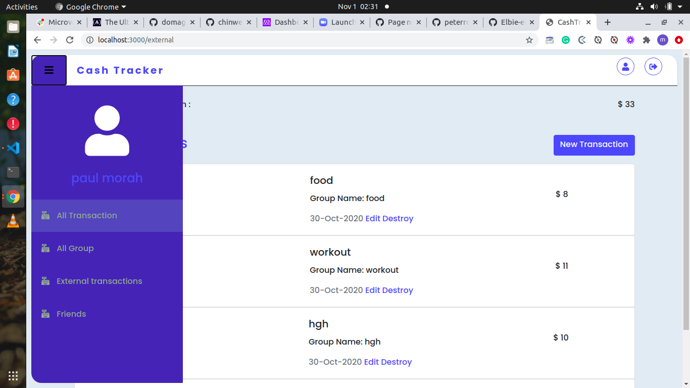

# Ruby on Rails - Cash Tracker Application
> This project is the capstone project for ruby on rails path at microverse coding school.
> It's an implementation of an app that tracks personal financial transactions.

## Built With

- Ruby 2.5.5
- Ruby on rails 6.0.0
- VS Code
- SQLite database

## How to Install

- Install Ruby in your system. To install Ruby, you can read the [Documentation](https://www.ruby-lang.org/en/documentation/installation/)
- Install rails to do that run this command in your console
    ``` 
    gem install rails

    ``` 
- Then For Windows users, open Command Prompt and run:
    ```console
    C:\>cd cash-tracker folder
    C:\cd cash-tracker folder> run rails server
    ```
- Open another terminal or Command line and run:  

  ```
    $ rails db:migrate
    
    ``` 
- For Linux and Mac users, open a Terminal and run:
    ```console
    
    $ cd cash-tracker  folder
    $ run rails server

    ``` 
- Navigate to your browser and run
 
   ```
   localhost:3000

   ```

   # Screenshots!





- To see the live site check here

   [Live Demo Link](https://peaceful-reef-82851.herokuapp.com/)


## Authors  

👤 **Paul chinweokwu Morah**

- Github: [@paulmorah](https://github.com/chinweokwu)
- Twitter: [@Morah89820846](https://twitter.com/Morah89820846)
- Linkedin: [Paul Chinweoku Morah](https://www.linkedin.com/in/morah-paul/)


## 🤝 Contributing

Contributions, issues and feature requests are welcome!. Feel free to check the [issues page](issues/).

## Show your support